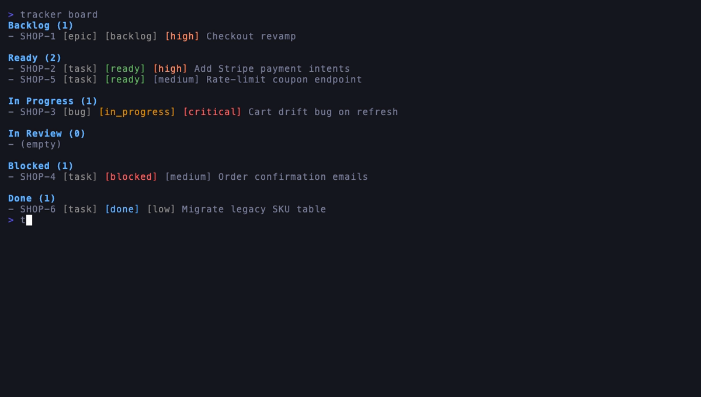
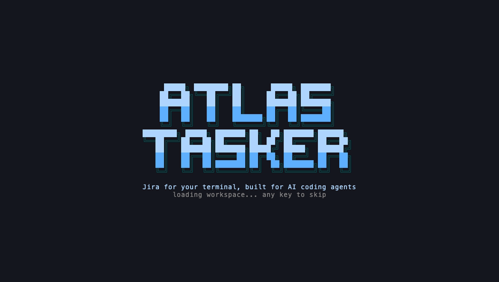
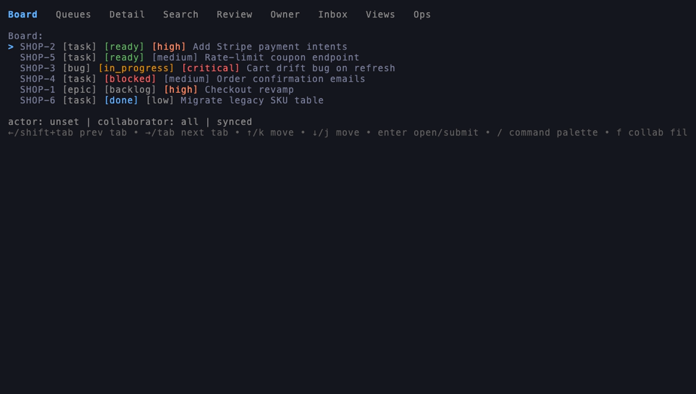
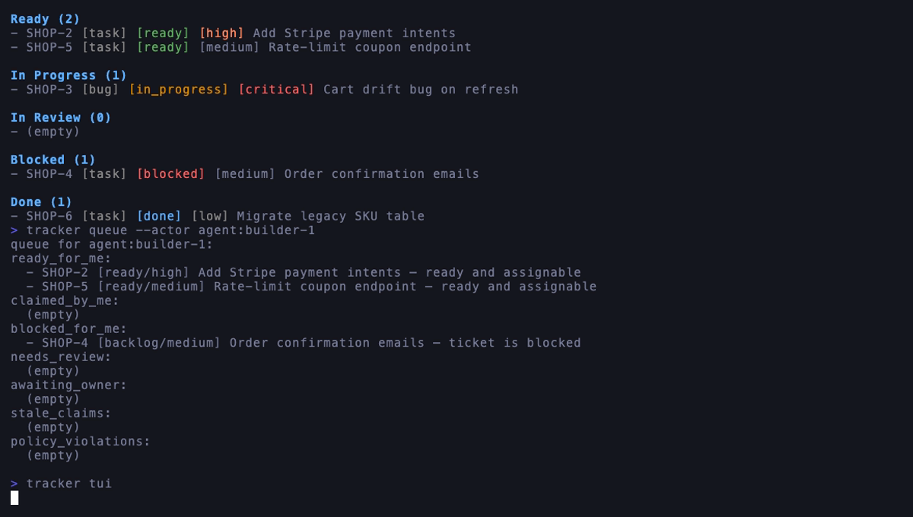
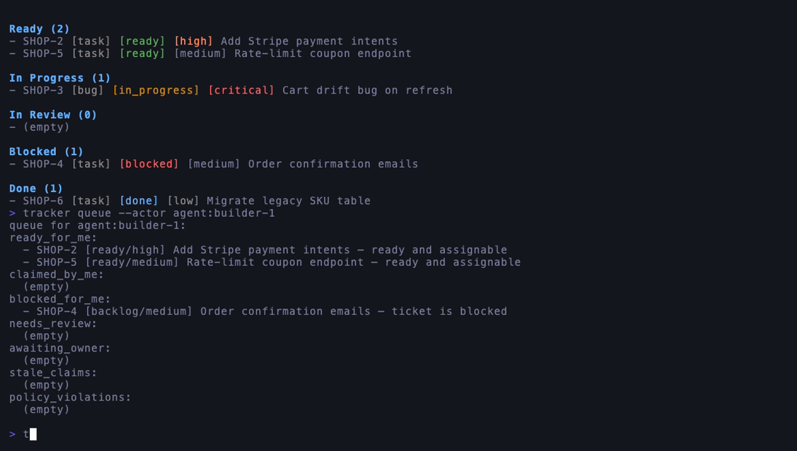

# Atlas Tasker


**Jira for your terminal, built for AI coding agents.**

[](https://github.com/myrrazor/atlas-tasker/actions/workflows/ci.yml)
[](https://github.com/myrrazor/atlas-tasker/releases)
[](LICENSE)

Atlas Tasker is a local-first issue tracker and orchestration layer that lives in your repo. You get Jira-grade tickets — boards, dependencies, review gates, audit history — as plain markdown files plus a fast SQLite index, with no server, no account, and no browser tab. Then it goes where Jira can't: your coding agents (Claude Code, Codex, anything that speaks MCP) claim tickets, get blocked on each other, wake up when their dependencies land, attach evidence, and hand work off for review.


## Install

```bash
curl -fsSL https://raw.githubusercontent.com/myrrazor/atlas-tasker/main/scripts/install.sh | VERSION=v1.9.0-rc2 sh
```

That's it. The installer downloads the release for your platform, verifies the checksum and the GitHub build attestation, and drops a single `tracker` binary into `/usr/local/bin` (set `BIN_DIR` to install somewhere else). Once a stable release ships, the `VERSION` pin goes away.

Building from source works too:

```bash
git clone https://github.com/myrrazor/atlas-tasker && cd atlas-tasker
go build -o tracker ./cmd/tracker
```

## Five minutes to a working board

```bash
tracker init
tracker project create APP "My App"
tracker ticket create --project APP --title "Ship first feature" --type task --actor human:owner --reason "first ticket"
tracker ticket move APP-1 ready --actor human:owner --reason "groomed"
tracker board
```



Every ticket is a markdown file under `projects/`, every change is an append-only event in `.tracker/`, and a SQLite projection keeps queries instant. Your tracker ships with your repo: branch it, diff it, `git blame` a status change. If the index ever gets corrupted, `tracker doctor --repair` rebuilds it from the event log.

Prefer a full-screen view? `tracker tui` opens the interactive console — board, work queues, ticket detail with timeline, search, review and owner queues, inbox, and an ops dashboard, all keyboard-driven.







## Built for agents, not just humans

This is the part Jira doesn't do. Register your agents, assign them tickets, wire up the dependency graph, and let the workflow drive itself:

```bash
tracker agent create builder-1 --name "Builder" --provider claude --capability go \
  --actor human:owner --reason "register"
tracker ticket assign APP-2 agent:builder-1 --actor human:owner --reason "agent work"
tracker ticket link APP-2 --blocked-by APP-1 --actor human:owner --reason "needs the API first"
```

Each agent has its own work queue — what's ready for it, what it has claimed, what's still blocked and why:



When `APP-1` lands, Atlas notices that `APP-2` just became unblocked and wakes the assigned agent: it emits an `agent.work_available` event, records a wakeup you can inspect with `tracker agent wakeups list`, and — if you've opted in — launches a command of your choosing, no shell involved:

```bash
tracker agent auto set builder-1 --mode command \
  --argv claude --argv "work the tracker ticket {ticket_id}" \
  --actor human:owner --reason "auto pickup"
```

Around that core, agents get the full delivery loop:

- **Leases** stop two agents from grabbing the same ticket; stale claims expire on their own.
- **Runs** track each work session, with checkpoints and per-run git worktrees.
- **Evidence** attaches proof to runs — test output, diffs, logs, screenshots — so review isn't vibes.
- **Gates** block completion until a reviewer, owner, QA, or release check signs off.
- **Handoffs** package up changed files, open questions, and risks for the next agent.
- **MCP** exposes all of it as tools (`tracker mcp serve`), with tiered profiles from read-only to admin and typed approvals for high-impact operations.
- **Goal manifests** (`tracker goal brief APP-1 --md`) give an agent the full context of a ticket in one shot.

The [Claude Code guide](docs/guides/claude-code.md), [Codex guide](docs/guides/codex.md), and [generic agent guide](docs/guides/generic-agent.md) walk through real setups.

## Everything else you'd expect from a real tracker

Epics with progress rollups, subtasks, labels, priorities, comments, saved views, full-text search (`tracker search 'text~payment status=ready'`), bulk operations with dry-run previews, watch subscriptions, automations, a REPL shell, JSON output and stable exit codes on every command for scripting, import/export, archives, and a `doctor` that can actually fix things.

For the paranoid (complimentary): signed artifacts and trust keys, governance policies, structured redaction, signed audit packets, and side-effect-free restore planning. Read what Atlas deliberately does **not** claim in [security limitations](docs/security-limitations.md) — local-first means your filesystem is the trust boundary.

## Docs

Start at the [docs landing page](docs/README.md), or jump to [installation](docs/installation.md), [getting started](docs/getting-started.md), [your first agent workflow](docs/first-agent-workflow.md), [MCP for agents](docs/guides/mcp-for-agents.md), [the command reference](docs/reference/commands.md), or [troubleshooting](docs/troubleshooting.md).

## Status

`v1.9.0-rc2` is the current public release candidate — installable today with the one-liner above. Stable follows once the remaining [release gates](docs/release/public-release-gates.md) (human docs review and owner sign-off) close out. Found something broken? [Open an issue](https://github.com/myrrazor/atlas-tasker/issues) — and please don't paste private keys, tokens, or full `.tracker` archives into it. Security reports go through [private vulnerability reporting](SECURITY.md).

## Contributing

PRs welcome — read [CONTRIBUTING.md](CONTRIBUTING.md) for the local gates (tests, vet, no secrets in examples). The project is MIT licensed.
