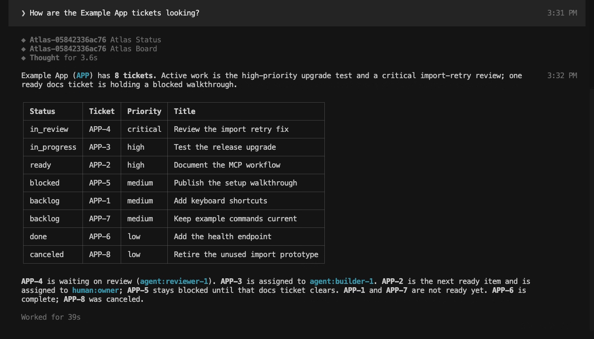
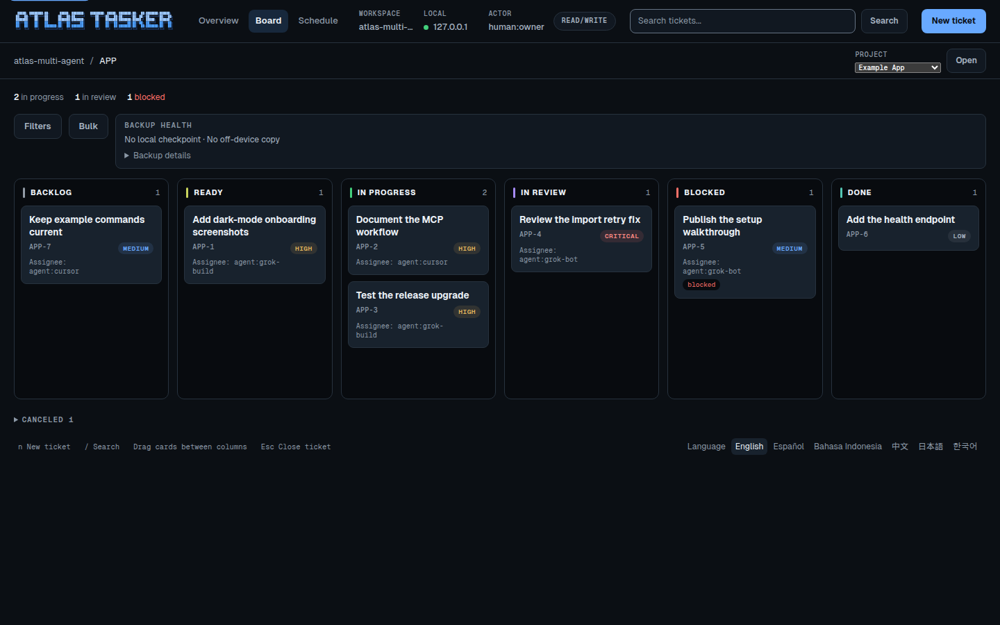
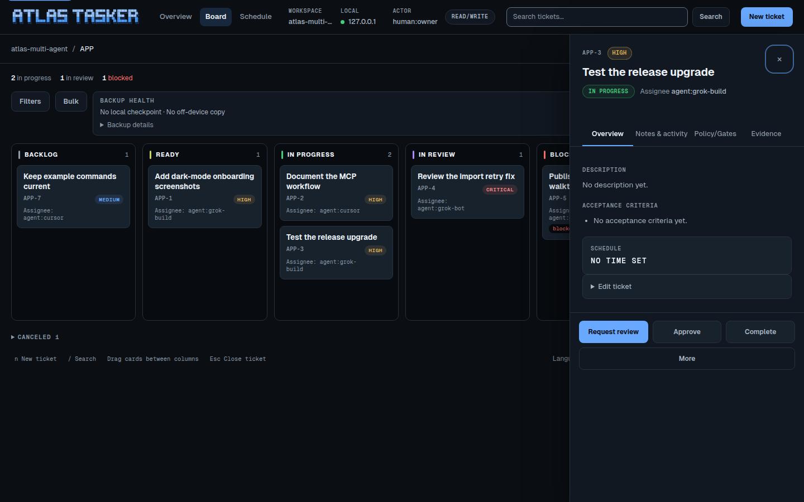
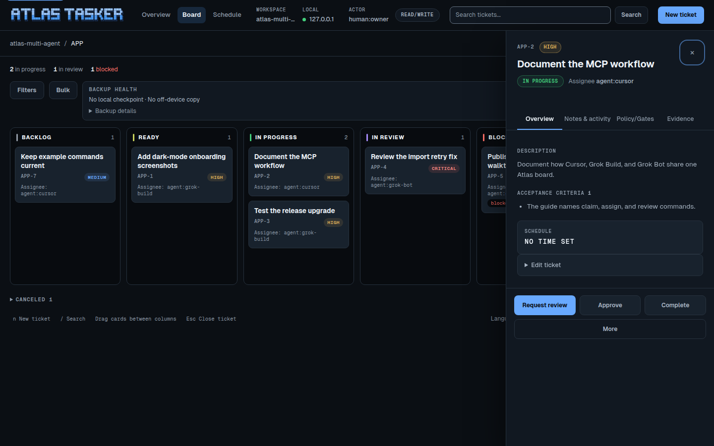
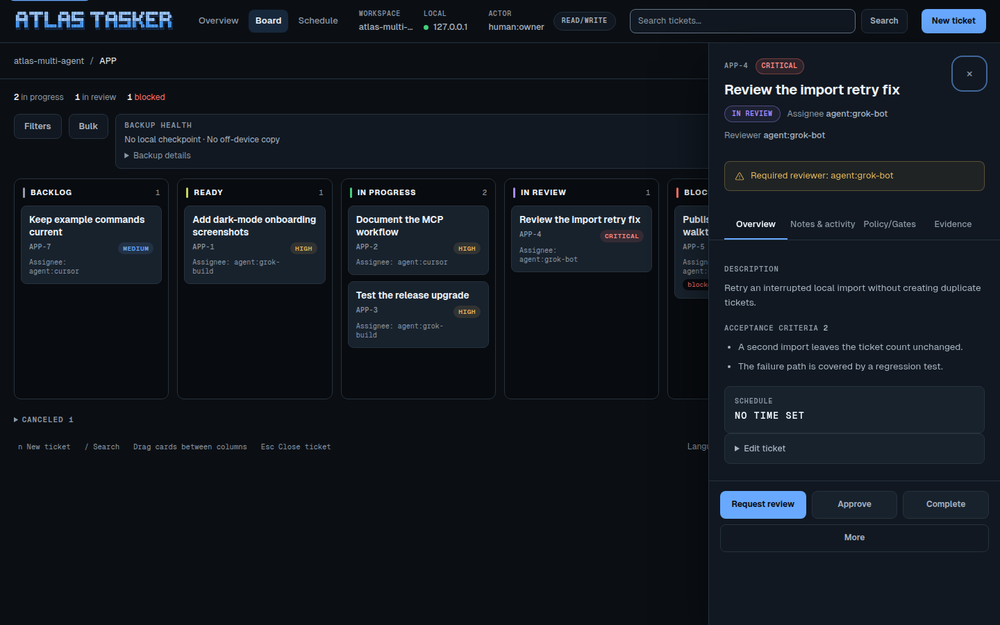
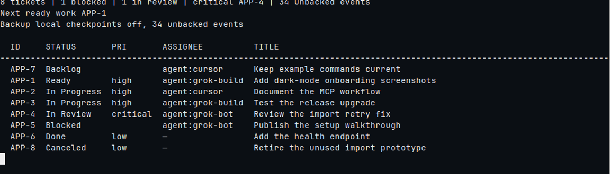
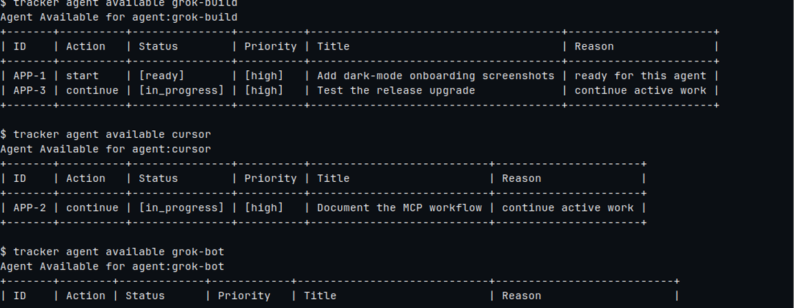

# Atlas Tasker


**Jira for your terminal, built for AI coding agents.**

[](https://github.com/myrrazor/atlas-tasker/actions/workflows/ci.yml)
[](https://github.com/myrrazor/atlas-tasker/releases)
[](LICENSE)

Atlas Tasker is a local-first issue tracker and orchestration layer that lives in your repo. You get Jira-grade tickets — boards, dependencies, review gates, audit history — as plain markdown files plus a fast SQLite index, without a hosted service or an account. Then it goes where Jira can't: your coding agents (Claude Code, Codex, anything that speaks MCP) claim tickets, get blocked on each other, wake up when their dependencies land, attach evidence, and hand work off for review.

## Get started

Install Atlas once:

```bash
curl -fsSL https://raw.githubusercontent.com/myrrazor/atlas-tasker/main/scripts/install.sh | sh
```

Open your project in your coding agent and ask:

```text
Initialize Atlas Tasker in this project.
```

Atlas sets up the board, local checkpoints, and integrations for supported agents installed on your machine. Restart your agent to load the integration.

Then ask normally:

```text
What's the current status of this project?
```

**v1.15 preview:** This walkthrough uses the current source. The installer downloads the latest published release; these setup features become available when v1.15 is released. See [Install](#install) to build this version now.

### A real Grok Build session

[](https://atlastasker.com/#agent-demo)

**[Watch the walkthrough](https://atlastasker.com/#agent-demo)**: ask for status, add a high-priority ticket, and see it on the refreshed board. [Download the MP4](site/assets/grok-flow.mp4) · [Read the transcript](docs/examples/grok-video-transcript.md).

Recorded in Grok Build 4.6 (xhigh), using synthetic example tickets on a v1.15 source build. Silent video; pauses shortened. A [status-table screenshot](docs/assets/grok-status.png) is also available.

### Same board, many agents

Grok Build, Cursor, and Grok Bot can share one Atlas board. Assign each agent its own tickets; leases keep them from grabbing the same work. Recreate the synthetic board used in these captures:

```bash
TRACKER_BIN=/absolute/path/to/tracker sh examples/create-multi-agent-demo.sh /tmp/atlas-multi-agent
cd /tmp/atlas-multi-agent
tracker board
tracker agent available grok-build
tracker web serve --no-browser
```













[Watch the shared-board walkthrough](https://atlastasker.com/#shared-board) · [Download the MP4](site/assets/multi-agent-board.mp4) · [Read the transcript](docs/examples/multi-agent-board.md).

## Install

The curl installer and `go install ...@latest` install the latest **published** GitHub release. Atlas Home, global MCP (`mcp serve --global --tool-profile workflow`), and `tracker uninstall` live in this v1.15 source and are not on that published tag until a v1.15 release exists. Unstamped builds report `"version": "dev"`.

```bash
curl -fsSL https://raw.githubusercontent.com/myrrazor/atlas-tasker/main/scripts/install.sh | sh
```

The installer verifies the checksum and the GitHub build attestation, and drops a single `tracker` binary into `/usr/local/bin` (set `BIN_DIR` to install somewhere else, `VERSION` to pin a specific release). Unattended `curl | sh` never initializes the directory you happened to be in. The installer alone does not register coding agents.

With a Go toolchain (1.26.6 or newer):

```bash
go install github.com/myrrazor/atlas-tasker/cmd/tracker@latest
```

To try this source:

```bash
git clone https://github.com/myrrazor/atlas-tasker && cd atlas-tasker
go build -o tracker ./cmd/tracker
```

## Two commands

After a v1.15 `tracker` is on your `PATH`:

```bash
tracker init
tracker
```

`tracker init` writes identity, canonical `projects/` and `.tracker/` files, local checkpoints, and Atlas-managed coding-agent entries for clients it actually finds. `tracker` with no arguments starts or reuses the one machine-wide Home service on `127.0.0.1:7432`, opens Home in a TTY, and prints a usable URL (or JSON) otherwise. It works outside a repo. Standing inside a valid workspace also registers that workspace when auto-register is on. If something else already owns that port, Atlas fails instead of silently moving.

To seed a first ticket, use a directory named `app` so init's default project key is `APP`:

```bash
mkdir app && cd app
tracker init
tracker
tracker ticket create --project APP --title "Ship first feature" --type task --actor human:owner --reason "first ticket"
tracker ticket move APP-1 ready --actor human:owner --reason "groomed"
tracker board
```

The example directory is named `app`, so init's default project key is `APP` and the ticket command is valid. In a repo whose directory name is not `app`, use that generated key (or `MAIN` when the basename is too short) instead of `APP`. Extra projects are still `tracker project create AUTH "Auth"`.

Opt out of init's extras with `--no-agents` / `--skip-integrations`, `--no-backup`, `--no-register`, `--no-open`, or `--git-mode private|unmanaged`. `--integrations` still opens the older TTY picker.

Mutation commands resolve `--actor`, then `TRACKER_ACTOR`, then `actor.default`, and exit 2 before writing if none is set. There is no silent `human:owner` fallback.

The default terminal board is a polished table with aligned ticket rows and status colors. Choose `--style kanban` for side-by-side cards. `--json`, `--md`, `--plain`, and `NO_COLOR` remain available. Chat hosts get native Markdown; MCP Apps that implement the UI resource get a read-only board. Restart the coding agent after init so it loads the new MCP entry — a written config is `pending_client_restart` until the client actually connects.

The [getting started](docs/getting-started.md), [setup and backup](docs/guides/setup-and-backup.md), and [agent integrations](docs/guides/agent-integrations.md) guides cover the short path plus `tracker setup` and per-workspace MCP.


Every ticket is a markdown file under `projects/`, every change is an append-only event in `.tracker/`, and a SQLite projection keeps queries instant. Your tracker ships with your repo: branch it, diff it, `git blame` a status change. If the index goes missing or falls behind, the next command rebuilds it from the files and says so once on stderr; if it ever gets corrupted, `tracker reindex` or `tracker doctor --repair` rebuilds it from the event log.

Prefer a full-screen view? `tracker tui` opens the interactive console — board, work queues, ticket detail with timeline, search, review and owner queues, inbox, and an ops dashboard, all keyboard-driven. The Board tab uses the same table presentation as `tracker board`, with keyboard scrolling for long lists. Open ticket details explicitly with Enter.


## Atlas Home

`tracker` opens **Atlas Home** in the browser: workspaces, projects, attention, search, backup health, and settings, all on loopback. Routes include `/`, `/attention`, `/search`, `/w/<workspace-id>`, `/w/<workspace-id>/projects/<project-key>`, `/w/<workspace-id>/activity`, `/w/<workspace-id>/backup`, `/settings`, `/settings/agents`, and `/settings/workspaces`. The browser never posts an arbitrary filesystem path; Create board uses a path grant or a hit under configured discovery roots.

Home opens with a one-time claim in the URL fragment. It clears the fragment, then POSTs the claim to establish an HttpOnly loopback session cookie. That cookie is essential to the local app, not a marketing tracker. The marketing site at [atlastasker.com](https://atlastasker.com) sets none.

`tracker web serve --open` is still supported: welcome at `/`, board at `/board`, schedule at `/schedule`. Prefer Home for new setups. The chrome still ships in English, Spanish, Indonesian, Chinese, Japanese, and Korean ([i18n notes](docs/i18n-notes.md) lists the honest gaps). No hosted mode, no login system, no second database.


## Built for agents, not just humans

This is the part Jira doesn't do. Register your agents, assign them tickets, wire up the dependency graph, and let the workflow drive itself:

```bash
tracker agent create builder-1 --name "Builder" --provider claude --capability go \
  --actor human:owner --reason "register"
tracker ticket assign APP-2 agent:builder-1 --actor human:owner --reason "agent work"
tracker ticket link APP-2 --blocked-by APP-1 --actor human:owner --reason "needs the API first"
```

Each agent has its own work queue — what's ready for it, what it has claimed, what's still blocked and why:


When `APP-1` lands, Atlas notices that `APP-2` just became unblocked, moves it from `backlog` to `ready` on the agent's behalf (audited as `agent:atlas`), and wakes the assigned agent: it emits an `agent.work_available` event, records a wakeup you can inspect with `tracker agent wakeups list`, and — if you've opted in — launches a command of your choosing, no shell involved:

```bash
tracker agent auto set builder-1 --mode command \
  --argv claude --argv "work the tracker ticket {ticket_id}" \
  --actor human:owner --reason "auto pickup"
```

Tickets can also carry a one-time schedule. A human runner gets a durable due/overdue reminder through the normal notification sinks; an agent runner gets an Atlas wakeup, and command mode launches the configured worker at the tick. Set `FUTURE_AT` to an RFC3339 instant strictly after the current time, then run:

```bash
tracker schedule set APP-2 --at "$FUTURE_AT" --runner agent:builder-1 \
  --actor human:owner --reason "run the Monday check"
tracker schedule tick --actor human:owner --reason "scheduled tick"
```

Run `schedule tick` from cron, launchd, or whichever scheduler already owns cadence on your machine. Atlas keeps the ticket, wakeup, audit event, and completion history local; it does not add a hidden daemon. See [scheduled work](docs/scheduling.md) for the exact behavior.

Around that core, agents get the full delivery loop:

- **Leases** stop two agents from grabbing the same ticket; stale claims expire on their own.
- **Runs** track each work session, with checkpoints and per-run git worktrees.
- **Evidence** attaches proof to runs — test output, diffs, logs, screenshots — so review isn't vibes.
- **Gates** block completion until a reviewer, owner, QA, or release check signs off.
- **Handoffs** package up changed files, open questions, and risks for the next agent.
- **MCP** exposes all of it as tools. Init registers detected clients with `tracker mcp serve --global --tool-profile workflow`. Cross-workspace writes need an explicit `workspace_id`. Global and pinned `tracker mcp serve --workspace /path` default to `workflow`; use `--tool-profile read` or `--read-only` for inspection only. Grok setup automatically uses compatible names such as `atlas_status` and `atlas_board`. Profiles still go read → workflow → delivery → admin, with typed approvals for high-impact operations. Restart the client after a registration change. A written config is not proof the client is connected.
- **Goal manifests** (`tracker goal brief APP-1 --md`) give an agent the full context of a ticket in one shot.

To hand work off, install the Atlas worker skill and give the ticket to Claude Code, Codex, Cursor, OpenClaw, Grok, or another agent. The skill teaches the agent to read its queue, claim work, dispatch a run, attach evidence, request review, acknowledge wake-ups, and hand off context while everything is tracked in Atlas Tasker. Humans still choose where to intervene through assignments, review gates, owner gates, and explicit handoffs.

```bash
tracker team apply crossfire --actor human:owner --reason "agentic loop"
tracker integrations install           # interactive picker in a terminal
# scripted alternative: --targets claude,codex,cursor,openclaw,grok,generic
tracker ticket assign APP-2 agent:builder-1 --actor human:owner --reason "agent work"
tracker run dispatch APP-2 --agent agent:builder-1 --actor human:owner --reason "start tracked run"
tracker goal brief APP-2 --md
```

On the v1.15 candidate, `tracker init` both writes the worker skill and, unless you pass `--no-agents`, writes Atlas-managed MCP entries pointing at `tracker mcp serve --global --tool-profile workflow`. Status is `written`, `pending_client_restart`, or `unverified` from the actual file — never “connected” just because a config exists. `tracker integrations install` still writes skills later. Advanced `tracker setup` remains the v1.14 one-pass planner. See [agent integrations](docs/guides/agent-integrations.md) and [MCP for agents](docs/guides/mcp-for-agents.md).

**[AGENTS.md](AGENTS.md) is the file to hand an agent.** It leads with the things that trip
them up — every tracked CLI mutation needs an actor, reasons are recommended and sometimes mandatory,
MCP tracked writes need both, `project create` needs neither, and a forbidden transition is a
deliberate exit 4 — then the loop, the exit-code table, and the MCP registration one-liners.
`CLAUDE.md` imports it, so Claude Code picks it up too.

For humans setting things up, the [agent integrations guide](docs/guides/agent-integrations.md), [Claude Code guide](docs/guides/claude-code.md), [Codex guide](docs/guides/codex.md), and [generic agent guide](docs/guides/generic-agent.md) walk through real setups.

### Pick your team

You don't have to design the org chart yourself. One command turns a fresh workspace into a working agent team — profiles, runbook, separation-of-duties permissions, and the right completion gate included:

```bash
tracker team apply crossfire --actor human:owner --reason "team setup"
```

| Preset | What you get |
|---|---|
| `solo` | One builder working the whole board, completions stay open |
| `pair` | Builder + reviewer with an enforced review gate — builders can't approve their own work |
| `swarm` | Three builders pulling by routing weight, QA gate, owner delegate |
| `crossfire` | Codex builds, Claude reviews (flip it with `--provider claude`) — two different models keeping each other honest |

`tracker team show <preset>` previews the roster, `--dry-run` applies nothing, and re-running is always safe — existing agents are never overwritten. Then install the matching integration (`claude`, `codex`, `cursor`, `openclaw`, `grok`, or `generic`), file your tickets, and the agents handle claiming, building, review handoffs, and wake-ups on their own. The [team presets guide](docs/guides/team-presets.md) has the full walkthrough.

## Local checkpoints, then an explicit remote

Tickets already live in Git with your repo. Atlas also keeps **local checkpoints** of Atlas-owned records in an isolated bare repo under machine state (`$XDG_STATE_HOME/atlas-tasker/backups/<workspace-id>/` or `~/.local/state/atlas-tasker/backups/<workspace-id>/`). `tracker init` starts that local replica unless you pass `--no-backup`. Checkpoints coalesce (about 30s quiet, 5min max, 100 pending events) and do not rewrite your project Git HEAD, index, or remotes.

A remote is separate and never inferred from `origin`:

```bash
tracker backup target add --id private \
  --url git@github.com:you/atlas-backups.git \
  --acknowledge-data-boundary --attest-private
tracker backup auto enable --target private
tracker backup run --now
```

A successful push is not verified. Atlas fetches the remote commit into an empty temporary repo and checks the commit, workspace, manifest, tree, and files. Verification is remembered per target and is not claimed while the replica is blocked. Ticket writes stay available if the remote is offline. Restore is two-phase: `tracker backup restore-plan` then `restore-apply`, bound to the stored plan ID and digest. `file://` drills need `--allow-local-file` and are not off-device proof.

Details: [setup and backup](docs/guides/setup-and-backup.md).

## Uninstall the software, keep the boards

```bash
tracker uninstall          # preview: Atlas-owned binary, service, managed MCP blocks
tracker uninstall --yes    # apply the digest-bound plan; --apply is an alias
```

`/uninstall` in the tracker shell is the same preview/apply. Uninstall removes Atlas software only. Workspaces, `projects/`, `.tracker/`, tickets, events, backup repositories, history, targets, and registry pointers stay so a later install can rediscover them. No receipt, no delete. Homebrew/apt installs print the manager command instead of unlinking a Cellar path. See [uninstall](docs/guides/uninstall.md).

## Everything else you'd expect from a real tracker

Epics with progress rollups, subtasks, labels, priorities, comments, saved views, full-text search (`tracker search 'text~payment status=ready'`), bulk operations with dry-run previews, watch subscriptions, automations, a REPL shell, JSON output and stable exit codes on every command for scripting, import/export, archives, and a `doctor` that can actually fix things.

For the paranoid (complimentary): signed artifacts and trust keys, governance policies, structured redaction, signed audit packets, and side-effect-free restore planning. Read what Atlas deliberately does **not** claim in [security limitations](docs/security-limitations.md) — local-first means your filesystem is the trust boundary.

## Docs

Start at the [docs landing page](docs/README.md), or jump to [installation](docs/installation.md), [getting started](docs/getting-started.md), [Home and workspaces](docs/guides/home-and-workspaces.md), [setup and backup](docs/guides/setup-and-backup.md), [agent integrations](docs/guides/agent-integrations.md), [MCP for agents](docs/guides/mcp-for-agents.md), [doctor and repair](docs/guides/doctor-and-repair.md), [uninstall](docs/guides/uninstall.md), [the local web board](docs/web-board.md), [the command reference](docs/command-reference.md), or [troubleshooting](docs/troubleshooting.md).

## Status

The [latest stable release](https://github.com/myrrazor/atlas-tasker/releases/latest) is what the installer and `go install ...@latest` give you. [CHANGELOG.md](CHANGELOG.md) lists the changes, and each release page records its published artifacts and verification.

See [Install](#install) for the published-tag vs this-source split. v1.14 `tracker setup` remains as an advanced path. Hosted verification is recorded only on the corresponding release page.

`v1.9.0` was the first stable release, shipped with full [release gates](docs/release/public-release-gates.md): verified hosted assets, signed build attestations, an SBOM, and recorded release evidence. Found something broken? [Open an issue](https://github.com/myrrazor/atlas-tasker/issues) — and please don't paste private keys, tokens, or full `.tracker` archives into it. Security reports go through [private vulnerability reporting](SECURITY.md).

## Contributing

PRs welcome — read [CONTRIBUTING.md](CONTRIBUTING.md) for the local gates (tests, vet, no secrets in examples). The project is MIT licensed.
