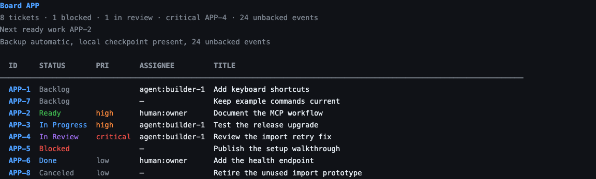
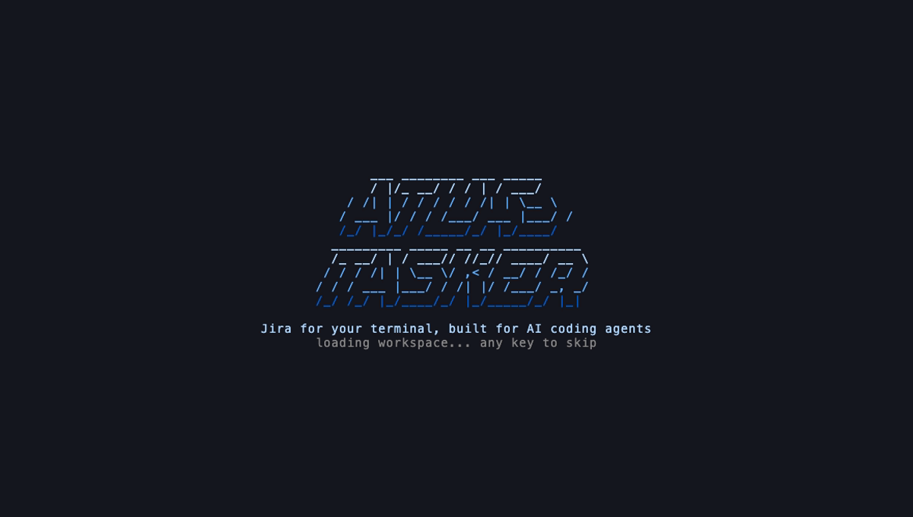
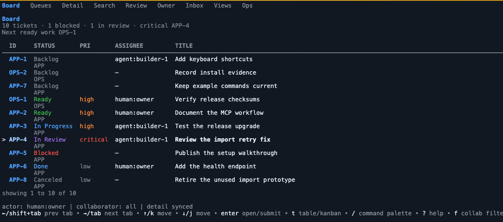
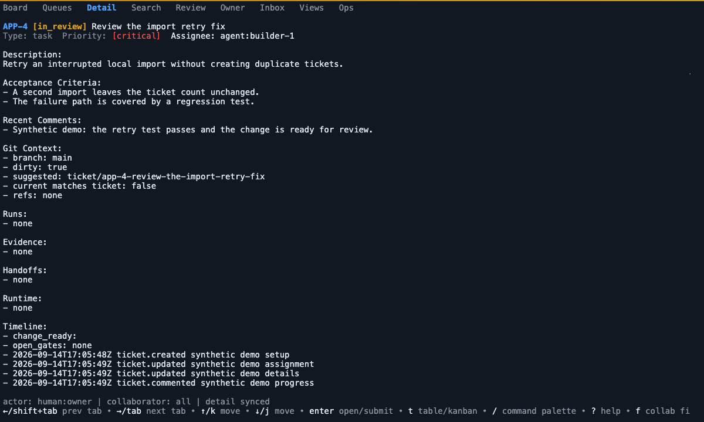
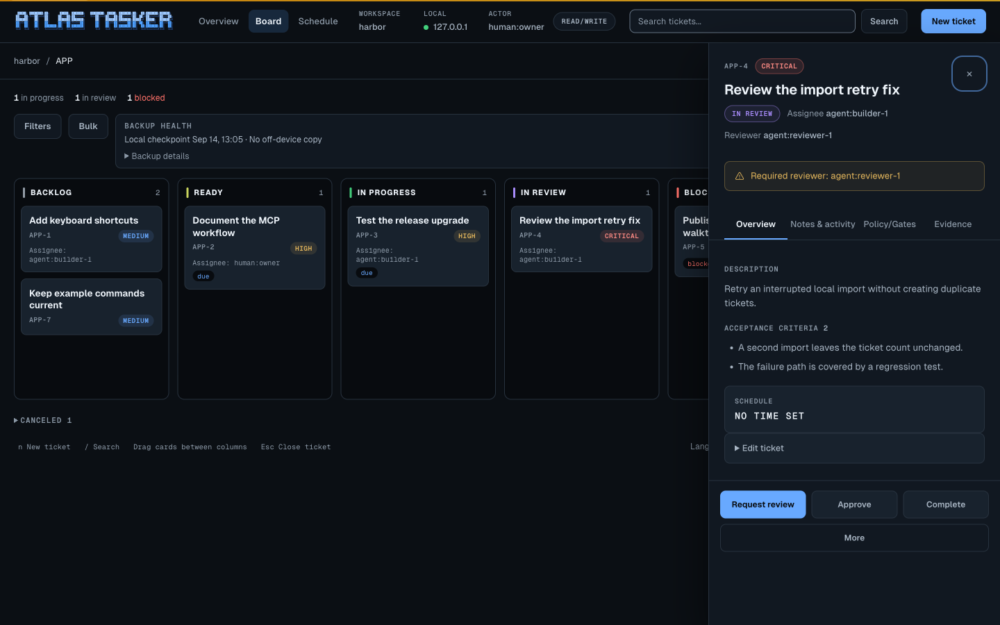
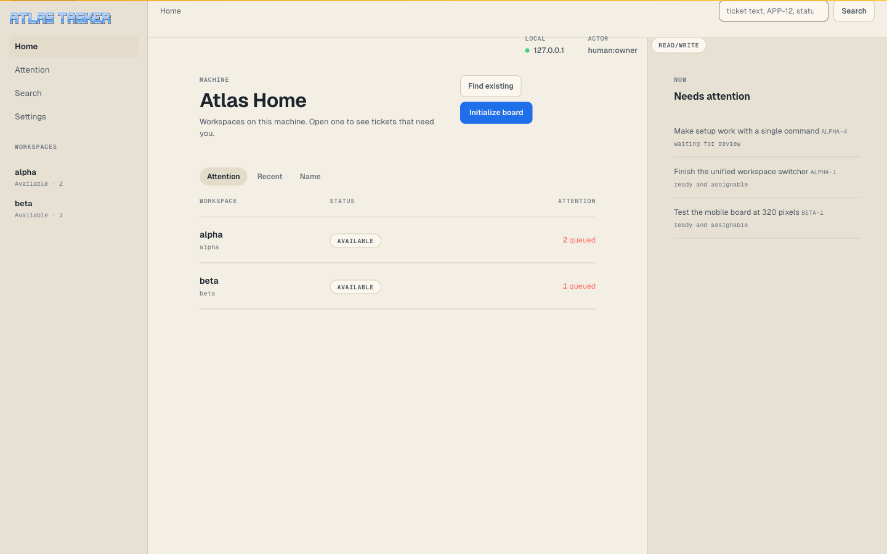
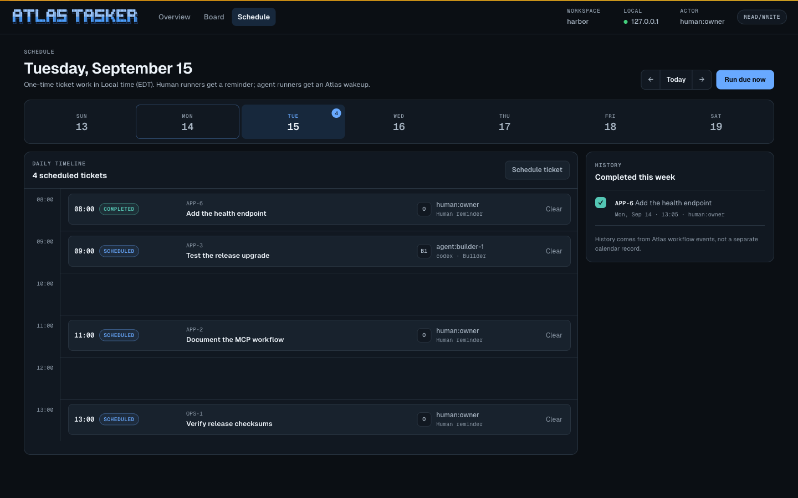
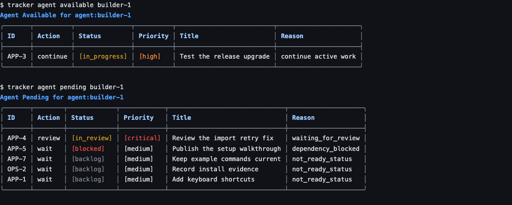

# Atlas Tasker


**Jira for your terminal, built for AI coding agents.**

[](https://github.com/myrrazor/atlas-tasker/actions/workflows/ci.yml)
[](https://github.com/myrrazor/atlas-tasker/releases)
[](LICENSE)

Atlas Tasker is a local-first issue tracker and orchestration layer that lives in your repo. You get Jira-grade tickets — boards, dependencies, review gates, audit history — as plain markdown files plus a fast SQLite index, without a hosted service or an account. Then it goes where Jira can't: your coding agents (Claude Code, Codex, anything that speaks MCP) claim tickets, get blocked on each other, wake up when their dependencies land, attach evidence, and hand work off for review.


## Install

```bash
curl -fsSL https://raw.githubusercontent.com/myrrazor/atlas-tasker/main/scripts/install.sh | sh
```

The installer downloads the latest release for your platform, verifies the checksum and the GitHub build attestation, and drops a single `tracker` binary into `/usr/local/bin` (set `BIN_DIR` to install somewhere else, `VERSION` to pin a specific release). In an interactive terminal it can also offer to initialize the current directory and open the coding-agent integration picker; that step defaults to **no**, shows the directory before changing it, and is skipped for non-interactive installs or when `SKIP_INTEGRATIONS=1` is set.

With a Go toolchain (1.26.6 or newer):

```bash
go install github.com/myrrazor/atlas-tasker/cmd/tracker@latest
```

Or from source:

```bash
git clone https://github.com/myrrazor/atlas-tasker && cd atlas-tasker
go build -o tracker ./cmd/tracker
```

## Minutes to a working board

```bash
tracker init
tracker project create APP "My App"
tracker ticket create --project APP --title "Ship first feature" --type task --actor human:owner --reason "first ticket"
tracker ticket move APP-1 ready --actor human:owner --reason "groomed"
tracker board
```

In a terminal, `tracker init` asks `Set up coding-agent integrations now? [Y/n]`; pressing Enter or answering yes opens the picker. This differs from the shell installer's optional workspace setup prompt, which defaults to **no**. In the picker, choose the detected agents, enter `none` to skip, or use `tracker init --skip-integrations` when you want a predictable non-interactive bootstrap. The [agent integrations guide](docs/guides/agent-integrations.md) covers every target and scripted setup.



Every ticket is a markdown file under `projects/`, every change is an append-only event in `.tracker/`, and a SQLite projection keeps queries instant. Your tracker ships with your repo: branch it, diff it, `git blame` a status change. If the index goes missing or falls behind, the next command rebuilds it from the files and says so once on stderr; if it ever gets corrupted, `tracker reindex` or `tracker doctor --repair` rebuilds it from the event log.

Prefer a full-screen view? `tracker tui` opens the interactive console — board, work queues, ticket detail with timeline, search, review and owner queues, inbox, and an ops dashboard, all keyboard-driven.







## The web board

Prefer a browser without giving up local-first storage? `tracker web serve --open` starts the optional local web UI on `127.0.0.1` — a welcome dashboard with per-project rollups, the Kanban board, and a schedule timeline — with a session token, CSRF checks, and the same `QueryService`/`ActionService` paths as the CLI. The dashboard and board chrome ship in English, Spanish, Indonesian, Chinese, Japanese, and Korean ([i18n notes](docs/i18n-notes.md) lists the honest gaps). It is still just your repo: no hosted mode, no login system, and no second database.







## Built for agents, not just humans

This is the part Jira doesn't do. Register your agents, assign them tickets, wire up the dependency graph, and let the workflow drive itself:

```bash
tracker agent create builder-1 --name "Builder" --provider claude --capability go \
  --actor human:owner --reason "register"
tracker ticket assign APP-2 agent:builder-1 --actor human:owner --reason "agent work"
tracker ticket link APP-2 --blocked-by APP-1 --actor human:owner --reason "needs the API first"
```

Each agent has its own work queue — what's ready for it, what it has claimed, what's still blocked and why:



When `APP-1` lands, Atlas notices that `APP-2` just became unblocked, moves it from `backlog` to `ready` on the agent's behalf (audited as `agent:atlas`), and wakes the assigned agent: it emits an `agent.work_available` event, records a wakeup you can inspect with `tracker agent wakeups list`, and — if you've opted in — launches a command of your choosing, no shell involved:

```bash
tracker agent auto set builder-1 --mode command \
  --argv claude --argv "work the tracker ticket {ticket_id}" \
  --actor human:owner --reason "auto pickup"
```

Tickets can also carry a one-time schedule. A human runner gets a durable due/overdue reminder through the normal notification sinks; an agent runner gets an Atlas wakeup, and command mode launches the configured worker at the tick:

```bash
tracker schedule set APP-2 --at 2026-08-10T09:00:00-04:00 --runner agent:builder-1 \
  --actor human:owner --reason "run the Monday check"
tracker schedule tick --actor human:owner --reason "scheduled tick"
```

Run `schedule tick` from cron, launchd, or whichever scheduler already owns cadence on your machine. Atlas keeps the ticket, wakeup, audit event, and completion history local; it does not add a hidden daemon. See [scheduled work](docs/scheduling.md) for the exact behavior.

Around that core, agents get the full delivery loop:

- **Leases** stop two agents from grabbing the same ticket; stale claims expire on their own.
- **Runs** track each work session, with checkpoints and per-run git worktrees.
- **Evidence** attaches proof to runs — test output, diffs, logs, screenshots — so review isn't vibes.
- **Gates** block completion until a reviewer, owner, QA, or release check signs off.
- **Handoffs** package up changed files, open questions, and risks for the next agent.
- **MCP** exposes all of it as tools (`tracker mcp serve`), with tiered profiles from read-only to admin and typed approvals for high-impact operations.
- **Goal manifests** (`tracker goal brief APP-1 --md`) give an agent the full context of a ticket in one shot.

To hand work off, install the Atlas worker skill and give the ticket to Claude Code, Codex, Cursor, OpenClaw, Grok, or another agent. The skill teaches the agent to read its queue, claim work, dispatch a run, attach evidence, request review, acknowledge wake-ups, and hand off context while everything is tracked in Atlas Tasker. Humans still choose where to intervene through assignments, review gates, owner gates, and explicit handoffs.

```bash
tracker team apply crossfire --actor human:owner --reason "agentic loop"
tracker integrations install           # interactive picker in a terminal
# scripted alternative: --targets claude,codex,cursor,openclaw,grok,generic
tracker ticket assign APP-2 agent:builder-1 --actor human:owner --reason "agent work"
tracker run dispatch APP-2 --agent agent:builder-1 --actor human:owner --reason "start tracked run"
tracker goal brief APP-2 --md
```

Integration installation writes project instructions, a guide, and skill or command files for the selected agent. It does **not** register an MCP server. If your agent should call Atlas as MCP tools, configure `tracker mcp serve` in that client separately and pin `--workspace` to this repo. See [agent integrations](docs/guides/agent-integrations.md) and [MCP for agents](docs/guides/mcp-for-agents.md).

**[AGENTS.md](AGENTS.md) is the file to hand an agent.** It leads with the things that trip
them up — every write needs `--actor` and `--reason`, `project create` needs neither, a
forbidden transition is a deliberate exit 4 — then the loop, the exit-code table, and the MCP
registration one-liners. `CLAUDE.md` imports it, so Claude Code picks it up too.

For humans setting things up, the [agent integrations guide](docs/guides/agent-integrations.md), [Claude Code guide](docs/guides/claude-code.md), [Codex guide](docs/guides/codex.md), and [generic agent guide](docs/guides/generic-agent.md) walk through real setups.

### Pick your team

You don't have to design the org chart yourself. One command turns a fresh workspace into a working agent team — profiles, runbook, separation-of-duties permissions, and the right completion gate included:

```bash
tracker team apply crossfire --actor human:owner --reason "team setup"
```

| Preset | What you get |
|---|---|
| `solo` | One builder working the whole board, completions stay open |
| `pair` | Builder + reviewer with an enforced review gate — builders can't approve their own work |
| `swarm` | Three builders pulling by routing weight, QA gate, owner delegate |
| `crossfire` | Codex builds, Claude reviews (flip it with `--provider claude`) — two different models keeping each other honest |

`tracker team show <preset>` previews the roster, `--dry-run` applies nothing, and re-running is always safe — existing agents are never overwritten. Then install the matching integration (`claude`, `codex`, `cursor`, `openclaw`, `grok`, or `generic`), file your tickets, and the agents handle claiming, building, review handoffs, and wake-ups on their own. The [team presets guide](docs/guides/team-presets.md) has the full walkthrough.

## Everything else you'd expect from a real tracker

Epics with progress rollups, subtasks, labels, priorities, comments, saved views, full-text search (`tracker search 'text~payment status=ready'`), bulk operations with dry-run previews, watch subscriptions, automations, a REPL shell, JSON output and stable exit codes on every command for scripting, import/export, archives, and a `doctor` that can actually fix things.

For the paranoid (complimentary): signed artifacts and trust keys, governance policies, structured redaction, signed audit packets, and side-effect-free restore planning. Read what Atlas deliberately does **not** claim in [security limitations](docs/security-limitations.md) — local-first means your filesystem is the trust boundary.

## Docs

Start at the [docs landing page](docs/README.md), or jump to [installation](docs/installation.md), [updating](docs/guides/updating.md), [getting started](docs/getting-started.md), [agent integrations](docs/guides/agent-integrations.md), [your first agent workflow](docs/first-agent-workflow.md), [scheduled work](docs/scheduling.md), [the local web board](docs/web-board.md), [MCP for agents](docs/guides/mcp-for-agents.md), [the command reference](docs/reference/commands.md), or [troubleshooting](docs/troubleshooting.md).

## Status

The [latest stable release](https://github.com/myrrazor/atlas-tasker/releases/latest) is what the installer and `go install ...@latest` give you. [CHANGELOG.md](CHANGELOG.md) lists the changes, and each release page records its published artifacts and verification.

The v1.12 source adds optional agent setup after a terminal install, saved preferences for all six web languages, and updated MCP, integration, and updater guides. The [v1.12 release evidence](docs/release/v1.12.0-release-evidence.md) records preparation and owner approval; hosted verification is recorded on the corresponding release pages. Development-branch documentation can describe changes ahead of the latest published tag.

`v1.9.0` was the first stable release, shipped with full [release gates](docs/release/public-release-gates.md): verified hosted assets, signed build attestations, an SBOM, and recorded release evidence. Found something broken? [Open an issue](https://github.com/myrrazor/atlas-tasker/issues) — and please don't paste private keys, tokens, or full `.tracker` archives into it. Security reports go through [private vulnerability reporting](SECURITY.md).

## Contributing

PRs welcome — read [CONTRIBUTING.md](CONTRIBUTING.md) for the local gates (tests, vet, no secrets in examples). The project is MIT licensed.
