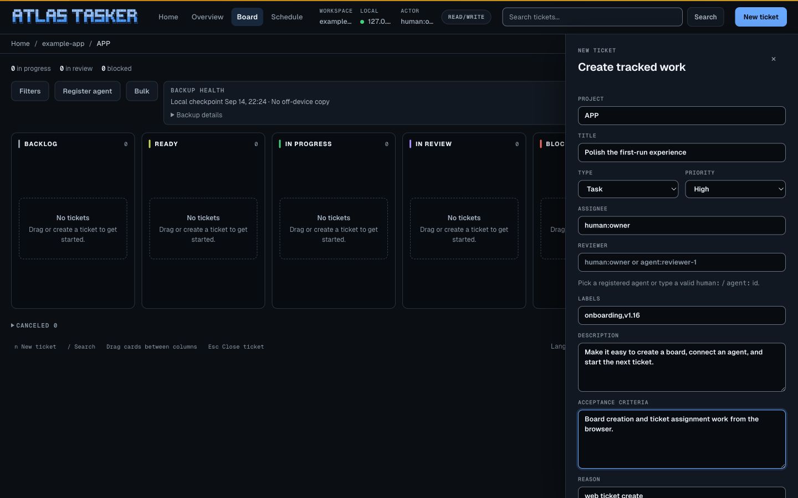

# v1.16 browser captures

The current stills were captured from the v1.16 source in a real Chrome browser on macOS, in dark mode, on 2026-09-15. They show a synthetic Example App workspace, not a customer deployment.

- Home created the board and APP project.
- The browser created APP-1 and the CLI verified the stored ticket.
- The remaining example tickets and agent profiles were seeded through the CLI to show multiple assignments and workflow columns.
- Desktop captures are 1440 × 900. The phone drawer is 390 × 844, with no horizontal page overflow.
- Grok Build and Cursor profiles use the supported `custom` provider type. Profile assignment alone does not start an agent process.

The [Grok recording](grok-video-transcript.md) and [shared-board walkthrough](multi-agent-board.md) remain their original v1.15 captures. Their captions describe the recorded source accurately and do not advertise a duration.
