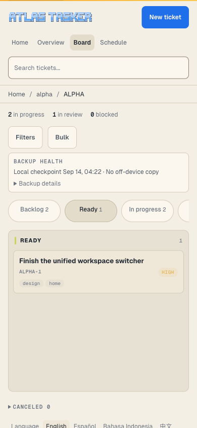
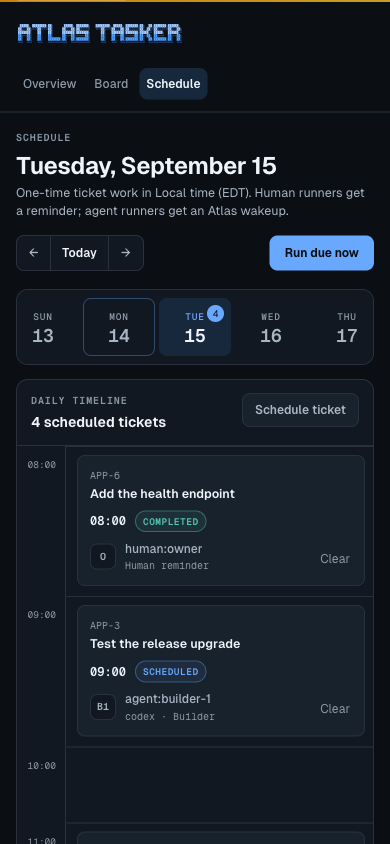

# Web Board

Atlas Tasker includes an optional local browser board:

```bash
tracker web serve --open
```

The web UI runs from the current workspace and uses the same canonical services as the CLI and TUI. It is a browser view over local Markdown snapshots, append-only JSONL events, and the SQLite projection; it is not a hosted server or separate database.

The root page is a workspace welcome view with per-project active, backlog, done, and blocked counts plus the latest ticket changes. Project links open `/board?project=KEY`; `/board` remains the canonical Kanban route. The settings link shows `web.owner_name`, `web.lang`, `actor.default`, and agent color preferences read-only.

Canceled tickets have their own board column and keep `canceled` in JSON and web card status data. They do not count as Done or satisfy dependencies. Cards and terminal board/ticket views show assignees directly. Assigned backlog tickets remain visible on the board; they become actionable through `agent available` after promotion to `ready` (with the existing special handling for newly unblocked dependencies).

The welcome page, settings, and board chrome ship in English, Spanish, Indonesian, Chinese, Japanese, and Korean. Choose a page language with the footer links or set a workspace default with `tracker config set web.lang ja`. All six codes (`en`, `es`, `id`, `zh`, `ja`, `ko`) are accepted. A `?lang=` query takes precedence over workspace config, then Atlas checks `Accept-Language` and falls back to English. The `/schedule` page remains English-only. Ticket content is never translated.

The browser workspace supports:

- viewing workflow columns
- opening ticket detail
- creating and editing tickets
- adding comments
- moving tickets through workflow states
- request-review, approve, and complete actions where policy allows
- project, actor, saved-view, and search/filter URL state
- drag/drop where JavaScript is available, plus button-based fallbacks (keyboard: `n` new ticket, `/` search)
- creating projects from the welcome page through the same `ActionService` and browser security gates
- a `/schedule` week strip and hourly timeline for one-time human reminders and agent wakeups
- setting, replacing, clearing, and ticking schedules through the same audited action service as the CLI
- weekly completion history derived from ticket workflow events

Schedule times are entered and displayed in the web server's named local timezone, then stored as UTC instants. Setting or replacing a schedule requires a future time; an existing schedule can become overdue normally. Every block names its runner and current state. `Agent ready` means notify mode created a pending wakeup; `Agent launched` is shown only after command mode starts its configured process.

The “Run due now” action is the browser equivalent of `tracker schedule tick`. Atlas still does not run a hidden daemon, so use cron, launchd, or another trusted scheduler when due work must be processed without a person opening the page.

Default serve behavior binds to `127.0.0.1` on a random port and opens a session URL when `--open` is used. The session token stays valid for the lifetime of that server process and is printed only by `tracker web serve`; it is never written to disk.

## Screenshots

These captures use a synthetic workspace and the display name “User.” Reproduce the workspace with [the web demo fixture](../examples/create-web-demo.sh); see [capture instructions](examples/screenshot-fixtures.md).

Welcome dashboard:


Board desktop:


Mobile:



Schedule desktop:


Schedule mobile:


